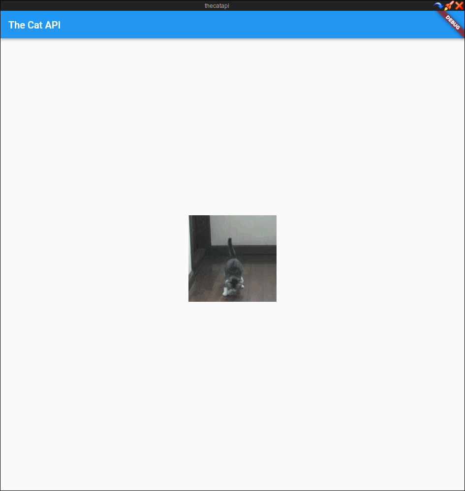

 

  <h3 align="center">TheCatAPI</h3>

  

    A Flutter Project built for a coding test for the Associate Software Engineer Role at ClearBank
     
     
  

  

## Table Of Contents

* [About the Project](#about-the-project)
* [Built With](#built-with)

## About The Project

For this project, I needed to:
1. Sign up and create an API key at [thecatapi](https://thecatapi.com)
2. Create an app that retrieves some data from one of the cat API endpoints (of my choice) and renders it on a web page.
3. Send a link for the git repo where the code is hosted to the hiring manager. The root folder of this repo should contain a screenshot showing my app rendering the cat data.

## Built With

This project was supposed to be built with a web development framework however, as I am not that knowledgeable in JavaScript frameworks, I developed the web app in Flutter.
